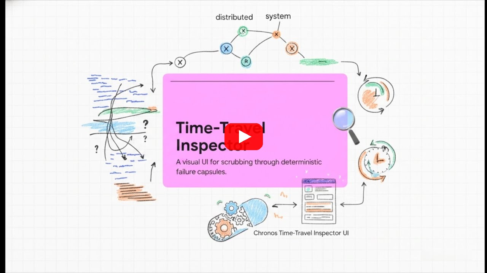
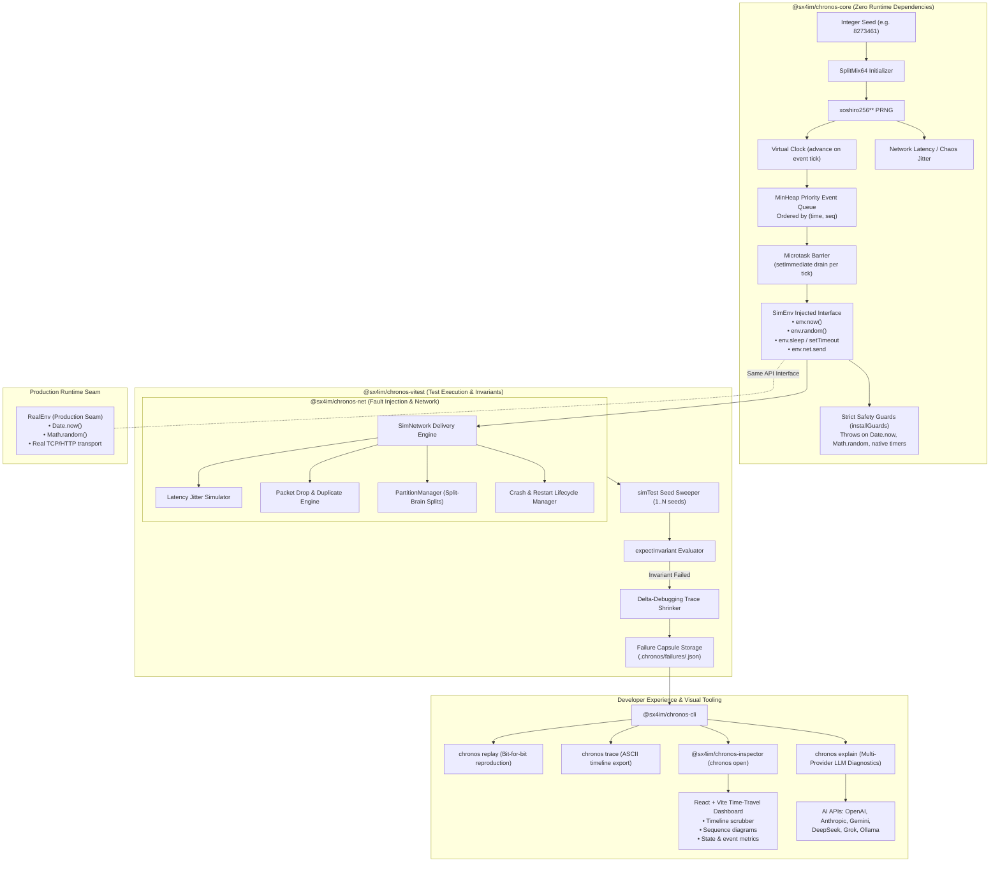

#  Chronos

**The Deterministic Simulation Testing (DST) Framework for Node.js & TypeScript**

[](https://www.npmjs.com/package/@sx4im/chronos-core)
[](https://www.npmjs.com/package/@sx4im/chronos-vitest)
[](./packages/core/test/determinism.test.ts)
[](./.github/workflows/ci.yml)
[](./LICENSE)
[](https://www.typescriptlang.org/)
[](https://vitest.dev/)

> **Find 1-in-a-million race conditions in concurrent & distributed systems and replay them bit-for-bit from a single integer seed.** Inspired by FoundationDB & TigerBeetle, built natively for TypeScript & Node.js.

---

## Explainer Video

[](https://www.youtube.com/watch?v=7d9_jUrygKM)

---

## Table of Contents

- [Why Chronos?](#why-chronos)
- [The Magic Moment](#the-magic-moment)
- [Key Features](#key-features)
- [Quickstart & Installation](#quickstart--installation)
- [Architecture & System Flow](#architecture--system-flow)
- [How Deterministic Simulation Testing (DST) Works](#how-deterministic-simulation-testing-dst-works)
- [Simulated Environment vs Real Environment](#simulated-environment-vs-real-environment)
- [Packages Overview](#packages-overview)
- [CLI Reference](#cli-reference)
- [Examples & Reference Implementations](#examples--reference-implementations)
- [Comparison: Chronos vs Traditional Testing vs Madsim / Turmoil](#comparison-chronos-vs-traditional-testing-vs-madsim--turmoil)
- [Contributing](#contributing)
- [License](#license)

---

## Why Chronos?

Async bugs, heisenbugs, and network race conditions in Node.js microservices, Raft consensus nodes, CRDTs, and distributed databases are notoriously hard to debug. They manifest once in CI, log an intermittent timeout, and disappear when you try to attach a debugger.

**Chronos solves this by replacing real-world entropy with deterministic virtual primitives.** It executes your concurrent code on a **single controlled thread** using:

* **Virtual Clock**: Fast-forwards time instantly (milliseconds or hours in fractions of a second).
* **Seeded PRNG**: `xoshiro256**` generator for 100% reproducible random choices.
* **Simulated Network**: Configurable latency, packet drops, duplication, network partitions, and node crash/restarts.
* **Entropy Safety Guards**: Fails fast if non-deterministic methods like `Date.now()`, `Math.random()`, or real `setTimeout` escape into your simulation.

If a failure occurs across 10,000 randomized simulation runs, Chronos outputs a **failure capsule** containing the exact seed. Running `chronos replay <capsule>` recreates the **exact execution path, bit-for-bit, every single time.**

---

## The Magic Moment

```ts
import { simTest, expectInvariant } from "@sx4im/chronos-vitest";

// Run 100 seeds across 3 simulated nodes under network drops & partitions
simTest("distributed counter never loses increments", {
  seeds: 100,
  nodes: 3,
  network: { dropProb: 0.05, dupProb: 0.01 },
  chaos: { partitionProb: 0.05, crashProb: 0.02 },
}, async (sim) => {
  // Interact with injected SimEnv on each simulated node
  for (const node of sim.nodes) {
    node.env.net.send(/* ... messages ... */);
  }
  
  await sim.settle();
  expectInvariant("no lost increments", () => total === expected);
});
```

When an invariant breaks, Chronos isolates the failure:

```text
✗ seed 8273461 violated "no lost increments" — total=99, expected=100
  → Failure capsule saved: .chronos/failures/8273461.json
  → Replay command: npx chronos replay .chronos/failures/8273461.json
```

---

## Key Features

* **100% Deterministic Execution**: Zero non-determinism. `Same Seed ⇒ Byte-Identical Event Trace`.
* **Simulated Fault-Injecting Network**: Simulates latency jitter, packet loss, reordering, duplicate delivery, network split-brains (partitions), and crash/restart node lifecycles.
* **Vitest Native Integration**: Drop `simTest` right into your standard Vitest or Jest test suite.
* **Time-Travel Inspector**: Serve an interactive web UI (`chronos open`) to scrub timeline events, inspect message state, step through logs, and generate sequence diagrams.
* **AI Failure Diagnostics**: Integrated `chronos explain` provider menu supporting OpenAI, Anthropic, Gemini, DeepSeek, xAI Grok, Ollama, and local models.
* **Zero Runtime Dependencies**: `@sx4im/chronos-core` is lightweight, ultra-fast, and has zero external dependencies.

---

## Quickstart & Installation

Install the Vitest integration and CLI tool:

```bash
# Using pnpm
pnpm add -D @sx4im/chronos-vitest @sx4im/chronos-cli

# Using npm
npm install --save-dev @sx4im/chronos-vitest @sx4im/chronos-cli

# Using yarn
yarn add -D @sx4im/chronos-vitest @sx4im/chronos-cli
```

### Running Your First DST Test

Add a test file `system.test.ts`:

```ts
import { simTest, expectInvariant } from "@sx4im/chronos-vitest";

simTest("cluster reaches consensus under chaos", { seeds: 500, nodes: 5 }, async (sim) => {
  // Access node environments via sim.nodes[i].env
  //   env.now()          -> Deterministic virtual clock time
  //   env.random()       -> Seeded PRNG random number (0..1)
  //   env.sleep(ms)      -> Virtual time sleep
  //   env.setTimeout()   -> Virtual timer handle
  //   env.net.send()     -> Simulated fault-injecting network
  
  await sim.settle();
  expectInvariant("single leader per term", () => countLeaders(sim) <= 1);
});
```

Run tests with Vitest:

```bash
npx vitest run
```

If a bug is found, inspect it with the Chronos CLI:

```bash
npx chronos replay .chronos/failures/<seed>.json    # Replay reproduction
npx chronos trace  .chronos/failures/<seed>.json    # View execution timeline
npx chronos open   .chronos/failures/<seed>.json    # Open Visual Time-Travel Inspector
```

---

## Architecture & System Flow

Chronos coordinates virtual time, seeded PRNG, discrete event scheduling, simulated fault-injecting networks, entropy guards, test execution, and visual inspection in a unified ecosystem:



---

## How Deterministic Simulation Testing (DST) Works

JavaScript runtimes (V8 / Node.js) are naturally single-threaded and deterministic for synchronous logic. Non-determinism enters through:

1. **System Clocks**: `Date.now()`, `performance.now()`, `process.hrtime()`
2. **Entropy Sources**: `Math.random()`, `crypto.getRandomValues()`
3. **Async Event Scheduling**: Non-deterministic OS socket I/O, timer scheduling, and microtask interleaving.

Chronos strips out these sources of non-determinism and wraps your system inside a single-threaded discrete event simulator:

1. **Seeded PRNG**: All randomness derives from a single `xoshiro256**` generator seeded by `SplitMix64`.
2. **MinHeap Priority Queue**: Events (timers, network packet deliveries, node crashes) are ordered by `(time, insert_sequence)`.
3. **Microtask Barrier**: Microtasks drain deterministically between discrete scheduler ticks.

---

## Simulated Environment vs Real Environment

Chronos provides a unified `Environment` contract (`SimEnv` in tests, `RealEnv` in production):

| Code Pattern | In Simulated DST (`SimEnv`) | In Production (`RealEnv`) |
| :--- | :--- | :--- |
| **Clock** | `env.now()` | `Date.now()` |
| **Randomness** | `env.random()` | `Math.random()` |
| **Sleep** | `await env.sleep(ms)` | `await new Promise(r => setTimeout(r, ms))` |
| **Timer** | `env.setTimeout(cb, ms)` | `setTimeout(cb, ms)` |
| **Networking** | `env.net.send(to, msg)` | Real TCP / HTTP / WebSocket transport |

The strict safety guards (`installGuards()`) automatically throw an exception if code inside a simulation attempts to call native non-deterministic APIs directly.

---

## Packages Overview

Chronos is organized as a modular TypeScript monorepo:

| Package | Version | Description |
| :--- | :--- | :--- |
| **[`@sx4im/chronos-core`](./packages/core)** | [](https://www.npmjs.com/package/@sx4im/chronos-core) | Core DST Engine (`PRNG`, `VirtualClock`, `MinHeap`, `Scheduler`, `SimEnv`, `RealEnv`, strict guards). Zero dependencies. |
| **[`@sx4im/chronos-net`](./packages/net)** | [](https://www.npmjs.com/package/@sx4im/chronos-net) | Simulated network layer (latency, drop, duplicate, partition splits, crash/restart lifecycle). |
| **[`@sx4im/chronos-vitest`](./packages/vitest)** | [](https://www.npmjs.com/package/@sx4im/chronos-vitest) | Vitest & Jest runner integrations (`simTest`, `expectInvariant`, `replayTest`, state shrinker). |
| **[`@sx4im/chronos-cli`](./packages/cli)** | [](https://www.npmjs.com/package/@sx4im/chronos-cli) | Command-line toolkit (`replay`, `trace`, `sweep`, `shrink`, `open`, `explain`, `stats`, `check`, `export`, `doctor`). |
| **[`@sx4im/chronos-inspector`](./packages/inspector)** | [](https://www.npmjs.com/package/@sx4im/chronos-inspector) | Web-based time-travel visual debugger (React + Vite + Tailwind UI). |

---

## CLI Reference

The `@sx4im/chronos-cli` binary provides comprehensive tools for managing simulations and failure capsules:

```bash
npx chronos <command> [options]
```

### Main Commands:

* **`chronos doctor`**: Check system Node.js environment compatibility and DST readiness.
* **`chronos check [paths...]`**: Statically analyze TypeScript/JavaScript source files for non-deterministic leaks.
* **`chronos replay <capsule>`**: Re-execute a failure capsule to verify bit-for-bit reproduction.
* **`chronos trace <capsule>`**: Output an ASCII execution timeline of events, network delivery, and state mutations.
* **`chronos sweep <scenario> [seeds]`**: Run a test scenario across $N$ seeds to discover hidden race conditions.
* **`chronos shrink <capsule>`**: Shrink a complex failure trace into the minimal reproducing steps.
* **`chronos open <capsule>`**: Launch the web-based time-travel inspector preloaded with the capsule data.
* **`chronos explain <capsule>`**: Get AI-powered failure analysis and root-cause explanations (supports Ollama, OpenAI, Anthropic, Gemini, Groq, DeepSeek, and more).
* **`chronos stats <capsule>`**: Print execution statistics, network packet metrics, and event distributions.
* **`chronos export <capsule> --format markdown|csv`**: Export trace timelines to Markdown documents or CSV reports.

---

## Examples & Reference Implementations

Explore ready-to-run examples in the repository:

1. **[`counter`](./examples/counter)**: A distributed counter with intentional race condition bugs. Demonstrates how Chronos catches non-idempotent duplicate messages and writes failure capsules.
2. **[`raft-lite`](./examples/raft-lite)**: A complete implementation of the Raft consensus algorithm (Leader Election, Log Replication, Term Validation) tested under intense chaos (drops, duplicates, partitions, node crashes) across **2,000 seeds**.

---

## Comparison: Chronos vs Traditional Testing vs Madsim / Turmoil

| Feature / Capability | Traditional Unit / Integration Tests | Jepsen / Chaos Mesh | Madsim / Turmoil (Rust) | Chronos (Node.js & TypeScript) |
| :--- | :--- | :--- | :--- | :--- |
| **Language** | Any | Clojure / Java | Rust | TypeScript / JavaScript |
| **100% Deterministic Replay** | No | No | Yes | Yes (Bit-for-Bit) |
| **Virtual Clock Fast-Forward** | Real time wait | Real time wait | Yes | Yes (Instant) |
| **Single-Thread Execution** | No | No | Yes | Yes (Single-Thread V8) |
| **Vitest / Jest Native** | Yes | No | No | Yes |
| **Visual Time-Travel Inspector** | No | No | No | Yes (`chronos open`) |
| **AI Failure Explainer** | No | No | No | Yes (`chronos explain`) |

---

## Contributing

We welcome contributions from the open-source community! 

Please read **[CONTRIBUTING.md](./CONTRIBUTING.md)** before submitting pull requests.

> **The Golden Rule of Chronos**: Determinism is the product. Any change that causes a given seed to generate a different execution trace is considered a breaking bug.

Review our **[Code of Conduct](./CODE_OF_CONDUCT.md)** for community guidelines.

---

## License

[MIT License](./LICENSE) © Saim Shafique
