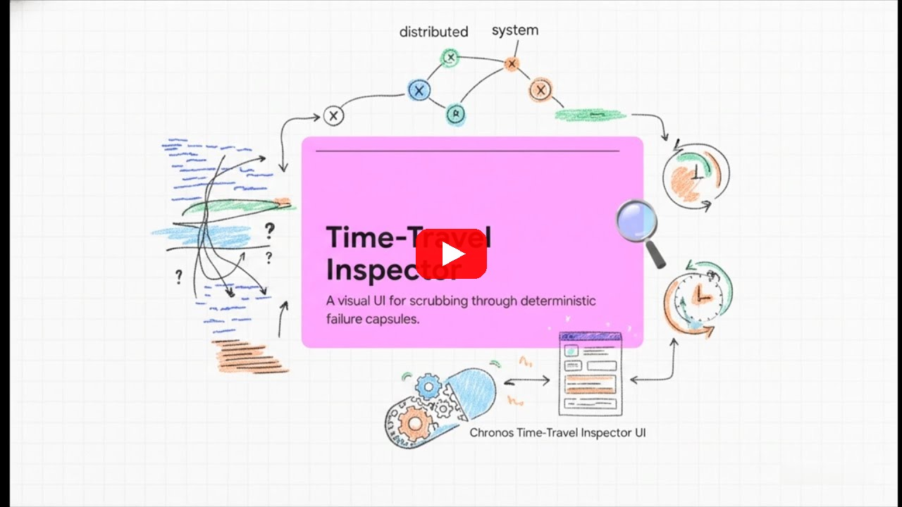
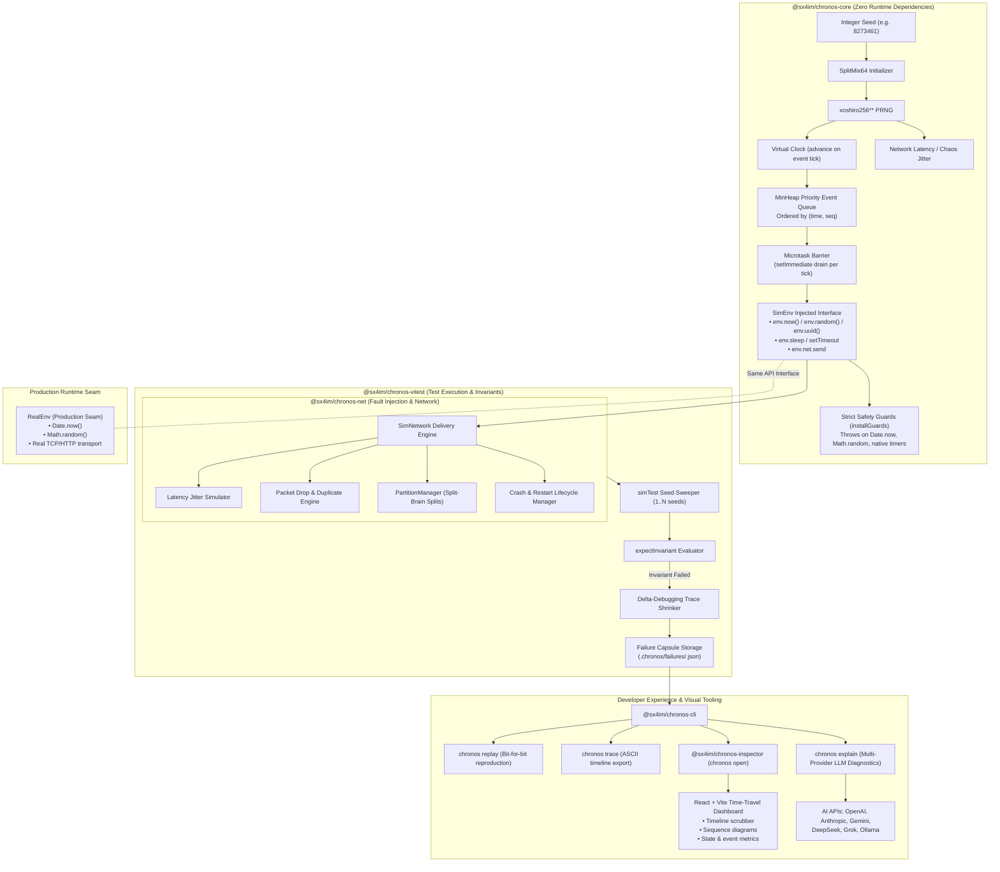

#  Chronos

**Deterministic Simulation Testing (DST) Framework for Node.js & TypeScript**

[](https://www.npmjs.com/package/@sx4im/chronos-core)
[](https://www.npmjs.com/package/@sx4im/chronos-vitest)
[](https://github.com/sx4im/chronos/actions/workflows/ci.yml)
[](./packages/core/test/determinism.test.ts)
[](./GOOD_FIRST_ISSUES.md)
[](./packages/core)
[](https://www.typescriptlang.org/)
[](https://vitest.dev/)
[](https://nodejs.org/)
[](./LICENSE)
[](https://github.com/sx4im/chronos)

> **Find 1-in-a-million race conditions in concurrent & distributed systems and replay them bit-for-bit from a single integer seed.** Inspired by FoundationDB & TigerBeetle, built natively for TypeScript & Node.js.

---

## ⚡ In 30 Seconds: The Problem Chronos Solves

Ever had a flaky test in CI that failed once and never reproduced locally? Or spent days tracking down a distributed race condition between microservices or asynchronous event handlers?

Async heisenbugs, network partitions, and timing races are notoriously difficult to debug because **real-world execution is non-deterministic**: system clocks tick unpredictably, OS threads interleave arbitrarily, and network packets arrive in unpredictable orders.

**Chronos eliminates external entropy and serializes your concurrent cluster onto a single controlled thread:**

* ⏱️ **Instant Virtual Time**: Fast-forwards simulated hours or days in milliseconds with zero real-time waiting.
* 🎲 **Seeded PRNG**: `xoshiro256**` pseudo-random generator guarantees that every coin flip, network delay, and scheduling decision is 100% reproducible.
* 🌐 **Simulated Chaos Network**: Injects latency jitter, packet loss, message duplication, network split-brains (partitions), and node crash/restart cycles.
* 🛡️ **Strict Entropy Guards**: Automatically intercepts and throws if code accidentally calls non-deterministic APIs (`Date.now()`, `Math.random()`, native `setTimeout`).
* 📦 **Failure Capsules & Replay**: When a safety invariant fails across 10,000 randomized simulation seeds, Chronos emits a failure capsule. Running `chronos replay <capsule>` recreates the **exact execution path, byte-for-byte, every single time.**

---

## 📺 Explainer Video

[](https://www.youtube.com/watch?v=7d9_jUrygKM)

---

## 🧭 Table of Contents

- [Why Chronos?](#why-chronos)
- [The Magic Moment](#the-magic-moment)
- [When to Use Chronos](#when-to-use-chronos)
- [Key Features](#key-features)
- [Quickstart & Installation](#quickstart--installation)
- [Architecture & System Flow](#architecture--system-flow)
- [How Deterministic Simulation Testing (DST) Works](#how-deterministic-simulation-testing-dst-works)
- [Simulated Environment vs Real Environment](#simulated-environment-vs-real-environment)
- [Packages Overview](#packages-overview)
- [CLI Reference](#cli-reference)
- [Examples & Reference Implementations](#examples--reference-implementations)
- [Comparison: Chronos vs Traditional Testing vs Madsim / Turmoil](#comparison-chronos-vs-traditional-testing-vs-madsim--turmoil)
- [Security](#security)
- [Contributing & Good First Issues](#contributing--good-first-issues)
- [License](#license)

---

## Why Chronos?

Distributed systems, microservices, consensus nodes, and CRDTs fail at the seams:
- **Network drops and reordering** cause state machines to process messages out-of-order.
- **Split-brain network partitions** lead to dual leaders or split voting terms.
- **Clock drift and timeout races** trigger spurious leader re-elections or premature aborts.
- **Uncoordinated retries** produce duplicate writes that violate idempotency.

Traditional testing tools (mock clocks, Jest timers, or real Docker containers) either:
1. Only test a single node with synchronous mock time, or
2. Run unrepeatable end-to-end chaos tests that take minutes to run and never reproduce the same failure twice.

Chronos gives JavaScript and TypeScript developers the **Deterministic Simulation Testing (DST)** superpowers pioneered by systems like **FoundationDB** and **TigerBeetle**, without leaving the familiar Node.js and Vitest ecosystem.

---

## The Magic Moment

Write your distributed safety invariants once with `simTest`:

```ts
import { simTest, expectInvariant } from "@sx4im/chronos-vitest";

// Run 500 randomized seeds across 3 simulated nodes under network chaos
simTest("distributed counter never loses increments", {
  seeds: 500,
  nodes: 3,
  network: { dropProb: 0.05, dupProb: 0.01 },
  chaos: { partitionProb: 0.05, crashProb: 0.02 },
}, async (sim) => {
  // Interact with injected SimEnv on each simulated node
  for (const node of sim.nodes) {
    node.env.net.send("counter-service", { type: "INCREMENT", amount: 1 });
  }
  
  await sim.settle();
  expectInvariant("no lost increments", () => total === expected);
});
```

When an invariant breaks, Chronos isolates the exact reproducing seed and creates a failure capsule:

```text
✗ seed 8273461 violated "no lost increments" — total=99, expected=100
  → Failure capsule saved: .chronos/failures/8273461.json
  → Replay command: npx chronos replay .chronos/failures/8273461.json
  → Interactive visual inspector: npx chronos open .chronos/failures/8273461.json
```

---

## 🎯 When to Use Chronos

| Use Case | What Chronos Tests | Example Systems |
| :--- | :--- | :--- |
| **Distributed Consensus & Coordination** | Split-brain elections, term increments, log divergence, uncommitted entry recovery | Raft, Paxos, Zab, Bully algorithm |
| **Local-First & CRDTs** | Convergence under out-of-order packets, concurrent edits, last-writer-wins tiebreakers | Automerge, Yjs, collaborative canvases, state-based CRDTs |
| **Distributed Transactions** | Two-phase commit (2PC) abort safety, coordinator crashes, participant timeouts | Sagas, distributed KV stores, payment settlement |
| **Microservice Event Workflows** | Idempotency under duplicate delivery, dead-letter recovery, retry storm backoff | Kafka/RabbitMQ consumer groups, SQS workflows, BullMQ |
| **Gossip & P2P Protocols** | Peer discovery, anti-entropy state synchronization, epidemic dissemination | HashiCorp Serf/Memberlist, BitTorrent DHT |
| **Network Protocol Drivers & WebSockets** | Heartbeat timeouts, connection drops, reconnect state reconciliation | Real-time gaming, financial exchange adapters |

---

## Key Features

* **100% Deterministic Execution**: Zero non-determinism. `Same Seed ⇒ Byte-Identical Event Trace`.
* **Simulated Fault-Injecting Network**: Simulates latency jitter, packet loss, reordering, duplicate delivery, network split-brains (partitions), and crash/restart node lifecycles.
* **Vitest Native Integration**: Drop `simTest` right into your standard Vitest test suites.
* **Time-Travel Inspector**: Serve an interactive web UI (`chronos open`) to scrub timeline events, inspect message state, step through logs, and generate sequence diagrams.
* **AI Failure Diagnostics**: Integrated `chronos explain` provider menu supporting OpenAI, Anthropic, Gemini, DeepSeek, xAI Grok, Ollama, and local models.
* **Zero Runtime Dependencies**: `@sx4im/chronos-core` is lightweight, ultra-fast, and has zero external dependencies.

---

## Quickstart & Installation

Install the Vitest integration and CLI toolkit:

```bash
# Using pnpm
pnpm add -D @sx4im/chronos-vitest @sx4im/chronos-cli

# Using npm
npm install --save-dev @sx4im/chronos-vitest @sx4im/chronos-cli

# Using yarn
yarn add -D @sx4im/chronos-vitest @sx4im/chronos-cli
```

### Running Your First DST Test

Add a test file `distributed.test.ts`:

```ts
import { simTest, expectInvariant } from "@sx4im/chronos-vitest";

simTest("cluster reaches consensus under chaos", { seeds: 500, nodes: 5 }, async (sim) => {
  // Access node environments via sim.nodes[i].env:
  //   env.now()          -> Deterministic virtual clock time
  //   env.random()       -> Seeded PRNG random number (0..1)
  //   env.uuid()         -> Deterministic RFC 4122 v4 UUID
  //   env.sleep(ms)      -> Virtual time sleep
  //   env.setTimeout()   -> Virtual timer handle
  //   env.net.send()     -> Simulated fault-injecting network
  
  await sim.settle();
  expectInvariant("single leader per term", () => countLeaders(sim) <= 1);
});
```

Run tests with Vitest:

```bash
npx vitest run
```

If a bug is found, inspect it with the Chronos CLI:

```bash
npx chronos replay .chronos/failures/<seed>.json    # Replay reproduction
npx chronos trace  .chronos/failures/<seed>.json    # View execution timeline
npx chronos open   .chronos/failures/<seed>.json    # Open Visual Time-Travel Inspector
```

---

## Architecture & System Flow

Chronos coordinates virtual time, seeded PRNG, discrete event scheduling, simulated fault-injecting networks, entropy guards, test execution, and visual inspection in a unified ecosystem:


```mermaid
flowchart TB
    subgraph CoreEngine["@sx4im/chronos-core (Zero Runtime Dependencies)"]
        Seed["Integer Seed (e.g. 8273461)"] --> SplitMix["SplitMix64 Initializer"]
        SplitMix --> PRNG["xoshiro256** PRNG"]
        
        PRNG --> Clock["Virtual Clock (advance on event tick)"]
        PRNG --> Latency["Network Latency / Chaos Jitter"]
        
        Clock --> MinHeap["MinHeap Priority Event Queue\nOrdered by (time, seq)"]
        
        MinHeap --> MicrotaskBarrier["Microtask Barrier\n(setImmediate drain per tick)"]
        
        MicrotaskBarrier --> SimEnv["SimEnv Injected Interface\n• env.now() / env.random() / env.uuid()\n• env.sleep / setTimeout\n• env.net.send"]
        
        SimEnv --> StrictGuards["Strict Safety Guards (installGuards)\nThrows on Date.now, Math.random, native timers"]
    end

    subgraph NetLayer["@sx4im/chronos-net (Fault Injection & Network)"]
        SimEnv --> NetFactory["SimNetwork Delivery Engine"]
        NetFactory --> LatencyJitter["Latency Jitter Simulator"]
        NetFactory --> LossEngine["Packet Drop & Duplicate Engine"]
        NetFactory --> Partitions["PartitionManager (Split-Brain Splits)"]
        NetFactory --> Lifecycle["Crash & Restart Lifecycle Manager"]
    end

    subgraph VitestRunner["@sx4im/chronos-vitest (Test Execution & Invariants)"]
        NetLayer --> SimTestRunner["simTest Seed Sweeper (1..N seeds)"]
        SimTestRunner --> SafetyInvariants["expectInvariant Evaluator"]
        SafetyInvariants -->|Invariant Failed| Shrinker["Delta-Debugging Trace Shrinker"]
        Shrinker --> CapsuleWriter["Failure Capsule Storage\n(.chronos/failures/<seed>.json)"]
    end

    subgraph DevTools["Developer Experience & Visual Tooling"]
        CapsuleWriter --> CLI["@sx4im/chronos-cli"]
        CLI --> ReplayCmd["chronos replay (Bit-for-bit reproduction)"]
        CLI --> TraceCmd["chronos trace (ASCII timeline export)"]
        CLI --> InspectorServer["@sx4im/chronos-inspector (chronos open)"]
        CLI --> AIExplainer["chronos explain (Multi-Provider LLM Diagnostics)"]
        
        InspectorServer --> ReactUI["React + Vite Time-Travel Dashboard\n• Timeline scrubber\n• Sequence diagrams\n• State & event metrics"]
        AIExplainer --> LLMProviders["AI APIs: OpenAI, Anthropic, Gemini,\nDeepSeek, Grok, Ollama"]
    end

    subgraph ProductionDual["Production Runtime Seam"]
        RealEnv["RealEnv (Production Seam)\n• Date.now()\n• Math.random()\n• Real TCP/HTTP transport"]
        SimEnv -. Same API Interface .- RealEnv
    end
```

---

## How Deterministic Simulation Testing (DST) Works

JavaScript runtimes (V8 / Node.js) are naturally single-threaded and deterministic for synchronous logic. Non-determinism enters through:

1. **System Clocks**: `Date.now()`, `performance.now()`, `process.hrtime()`
2. **Entropy Sources**: `Math.random()`, `crypto.getRandomValues()`
3. **Async Event Scheduling**: Non-deterministic OS socket I/O, timer scheduling, and microtask interleaving.

Chronos strips out these sources of non-determinism and wraps your system inside a single-threaded discrete event simulator:

1. **Seeded PRNG**: All randomness derives from a single `xoshiro256**` generator seeded by `SplitMix64`.
2. **MinHeap Priority Queue**: Events (timers, network packet deliveries, node crashes) are ordered by `(time, insert_sequence)`.
3. **Microtask Barrier**: Microtasks drain deterministically between discrete scheduler ticks via a controlled barrier.

---

## Simulated Environment vs Real Environment

Chronos provides a unified `Environment` contract (`SimEnv` in tests, `RealEnv` in production):

| Code Pattern | In Simulated DST (`SimEnv`) | In Production (`RealEnv`) |
| :--- | :--- | :--- |
| **Clock** | `env.now()` | `Date.now()` |
| **Randomness** | `env.random()` | Cryptographic float (53-bit CSPRNG) |
| **UUID** | `env.uuid()` (Deterministic RFC 4122 v4) | `crypto.randomUUID()` |
| **Sleep** | `await env.sleep(ms)` | `await new Promise(r => setTimeout(r, ms))` |
| **Timer** | `env.setTimeout(cb, ms)` | `setTimeout(cb, ms)` |
| **Networking** | `env.net.send(to, msg)` | Real TCP / HTTP / WebSocket transport |

The strict safety guards (`installGuards()`) automatically throw an exception if code inside a simulation attempts to call native non-deterministic APIs directly.

---

## Packages Overview

Chronos is organized as a modular TypeScript monorepo:

| Package | Version | Description |
| :--- | :--- | :--- |
| **[`@sx4im/chronos-core`](./packages/core)** | [](https://www.npmjs.com/package/@sx4im/chronos-core) | Core DST Engine (`PRNG`, `VirtualClock`, `MinHeap`, `Scheduler`, `SimEnv`, `RealEnv`, strict guards). Zero dependencies. |
| **[`@sx4im/chronos-net`](./packages/net)** | [](https://www.npmjs.com/package/@sx4im/chronos-net) | Simulated network layer (latency, drop, duplicate, partition splits, crash/restart lifecycle). |
| **[`@sx4im/chronos-vitest`](./packages/vitest)** | [](https://www.npmjs.com/package/@sx4im/chronos-vitest) | Vitest & Jest runner integrations (`simTest`, `expectInvariant`, `replayTest`, state shrinker). |
| **[`@sx4im/chronos-cli`](./packages/cli)** | [](https://www.npmjs.com/package/@sx4im/chronos-cli) | Command-line toolkit (`replay`, `trace`, `sweep`, `shrink`, `open`, `explain`, `stats`, `check`, `export`, `doctor`). |
| **[`@sx4im/chronos-inspector`](./packages/inspector)** | [](./packages/inspector) | Web-based time-travel visual debugger (React + Vite + Tailwind UI). |

---

## CLI Reference

The `@sx4im/chronos-cli` binary provides comprehensive tools for managing simulations and failure capsules:

```bash
npx chronos <command> [options]
```

### Main Commands:

* **`chronos doctor`**: Check system Node.js environment compatibility and DST readiness.
* **`chronos check [paths...]`**: Statically analyze TypeScript/JavaScript source files for non-deterministic leaks.
* **`chronos replay <capsule>`**: Re-execute a failure capsule to verify bit-for-bit reproduction.
* **`chronos trace <capsule>`**: Output an ASCII execution timeline of events, network delivery, and state mutations.
* **`chronos sweep <scenario> [seeds]`**: Run a test scenario across $N$ seeds to discover hidden race conditions.
* **`chronos shrink <capsule>`**: Shrink a complex failure trace into the minimal reproducing steps.
* **`chronos open <capsule>`**: Launch the web-based time-travel inspector preloaded with the capsule data.
* **`chronos explain <capsule>`**: Get AI-powered failure analysis and root-cause explanations. Set `OPENAI_API_KEY`, `ANTHROPIC_API_KEY`, or `GEMINI_API_KEY` — or point `LLM_BASE_URL` at any OpenAI-compatible endpoint (Ollama, LM Studio, vLLM, OpenRouter, Groq, …).
* **`chronos stats <capsule>`**: Print execution statistics, network packet metrics, and event distributions.
* **`chronos export <capsule> --format markdown|csv`**: Export trace timelines to Markdown documents or CSV reports.

---

## 🧪 Examples & Reference Implementations

Explore complete, production-grade distributed system reference implementations tested under intense chaos in the repository:

| System / Algorithm | Directory | Tested Invariants | Chaos Injected | Seeds Verified |
| :--- | :--- | :--- | :--- | :--- |
| **Raft Consensus** | [`examples/raft-lite`](./examples/raft-lite) | • Single leader per term<br>• Log matching & commit index<br>• Term monotonicity | Drops, duplicates, partitions, node crashes | **2,000 seeds** (100% pass) |
| **CRDT (LWW-Register)** | [`examples/crdt`](./examples/crdt) | • Strong Eventual Consistency (SEC)<br>• LWW tiebreaker convergence | Packet loss, out-of-order reordering, partitions | **1,000 seeds** (100% pass) |
| **Gossip Protocol** | [`examples/gossip`](./examples/gossip) | • Anti-entropy key agreement<br>• Monotonic versioning across peers | Asymmetric partitions, packet drops, node crashes | **1,000 seeds** (100% pass) |
| **Two-Phase Commit (2PC)** | [`examples/twophase-commit`](./examples/twophase-commit) | • Transaction atomicity (never mixed commit/abort)<br>• Non-spontaneous commit | Participant crashes, coordinator timeouts | **1,000 seeds** (100% pass) |
| **Distributed Counter** | [`examples/counter`](./examples/counter) | • Exact increment totals<br>• Duplicate write idempotency | Message duplicates, packet drops | Failure capsule demo |

---

## Comparison: Chronos vs Traditional Testing vs Madsim / Turmoil

| Feature / Capability | Traditional Unit / Integration Tests | Jepsen / Chaos Mesh | Madsim / Turmoil (Rust) | Chronos (Node.js & TypeScript) |
| :--- | :--- | :--- | :--- | :--- |
| **Language** | Any | Clojure / Java | Rust | TypeScript / JavaScript |
| **100% Deterministic Replay** | No | No | Yes | **Yes (Bit-for-Bit)** |
| **Virtual Clock Fast-Forward** | Real time wait | Real time wait | Yes | **Yes (Instant)** |
| **Single-Thread Execution** | No | No | Yes | **Yes (Single-Thread V8)** |
| **Vitest / Jest Native** | Yes | No | No | **Yes (`simTest`)** |
| **Visual Time-Travel Inspector** | No | No | No | **Yes (`chronos open`)** |
| **AI Failure Explainer** | No | No | No | **Yes (`chronos explain`)** |

---

## Security

**A failure capsule is untrusted input.** Capsules exist to be shared — attached to an issue, produced by someone else's CI, handed to a teammate — so Chronos treats one exactly like a file from a stranger. Every capsule is fully validated at the read boundary, capsule paths are confined to your project, and capsule text is escaped separately for each place it is rendered (terminal, CSV, Markdown, and the Inspector's DOM).

One consequence worth stating outright: `env.random()` under `SimEnv` is a **seeded** PRNG. It is deterministic by design and therefore completely predictable — never use it as a source of secrets in a simulated run. The production `RealEnv` backs the same call with a CSPRNG, so the same application code is safe in production.

Read **[SECURITY.md](./SECURITY.md)** for the full threat model and how to report a vulnerability.

---

## 🤝 Contributing & Good First Issues

We warmly welcome contributions from the community!

Whether you are looking to add a new network fault, build a new distributed algorithm example, improve the web inspector, or expand CLI tooling:

👉 **Check out our [Good First Issues Catalog](./GOOD_FIRST_ISSUES.md)** for curated, pre-scoped starter tasks with step-by-step guidance!

Please read our **[CONTRIBUTING.md](./CONTRIBUTING.md)** and review our **[Code of Conduct](./CODE_OF_CONDUCT.md)** before opening a pull request.

> **The Golden Rule**: *Determinism is the product.* Any change that causes a given seed to generate a different execution trace is considered a breaking bug.

### Contributors

Made with [contrib.rocks](https://contrib.rocks).

[](https://github.com/sx4im/chronos/graphs/contributors)

---

## License

[MIT License](./LICENSE) © Saim Shafique
